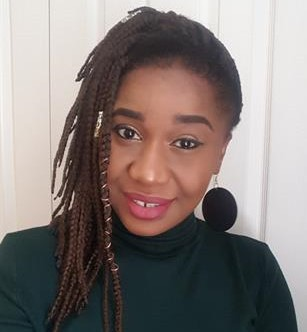

## Balaguer-Ballester lab

Our focus is on computational neuroscience. We devise machine-learning approaches and models for understanding neural dynamics underlying cognition; through close collaborations with human and animal neurophysiology labs. 
In this line of work, the lab’s methodology concentrates on analyzing multi-electrode array recordings and biophysical models in Hilbert spaces; we have also developed mesoscopic models of the auditory cortex. In addition, we are partners in multiple applied data analysis projects.

#### Featured recent publications

* Camps-Valls, G., Gerhardus, A., Ninad, U., Varando, G., Martius, G., Balaguer-Ballester, E., Vinuesa, R., Diaz, E., Zanna, L. and Runge, J., 2023. [Discovering Causal Relations and Equations from Data](https://arxiv.org/abs/2305.13341). arxiv.org/abs/2305.13341.
* Mavridou, I., Balaguer-Ballester, E., Nduka, C. and Seiss, E., 2023. [A reliable and robust online validation method for creating a novel 3D Affective Virtual Environment and Event Library](https://eprints.bournemouth.ac.uk/38441/1/Mavridou_2023.pdf). PLoS ONE, 18.
* Rupp, A., Englitz, B., Balaguer-Ballester, E. and Andermann, M., 2022. Editorial: [Early neural processing of musical melodies](https://www.frontiersin.org/research-topics/17250/early-neural-processing-of-musical-melodies). Frontiers in Human Neuroscience, 16.
* Balaguer-Ballester, E., Nogueira, R., Abofalia, J.M., Moreno-Bote, R. and Sanchez-Vives, M.V., 2020. [Representation of foreseeable choice outcomes in orbitofrontal cortex triplet-wise interactions](https://journals.plos.org/ploscompbiol/article?id=10.1371/journal.pcbi.1007862). PLoS Computational Biology, 16 (6).
* Tabas, A., Andermann, M., Schuberth, V., Riedel, H., Balaguer-Ballester, E. and Rupp, A., 2019. [Modeling and MEG evidence of early consonance processing in auditory cortex.](https://journals.plos.org/ploscompbiol/article?id=10.1371/journal.pcbi.1006820) PLoS Computational Biology, 15 (2).

#### More information and papers

[Interdisciplinary Neuroscience Research Centre (INRC) at Bournemouth University](https://www.bournemouth.ac.uk/research/centres-institutes/interdisciplinary-neuroscience-research-centre)
<br/>
[https://staffprofiles.bournemouth.ac.uk/display/eb-ballester](https://staffprofiles.bournemouth.ac.uk/display/eb-ballester)
<br/>
[http://orcid.org/0000-0002-0695-719](http://orcid.org/0000-0002-0695-7191)
<br/>
[https://www.overleaf.com?r=4307e306&rm=d&rs=b](https://www.overleaf.com)
<br/>
[](https://twitter.com/emilibalball) [@emilibalball](https://twitter.com/emilibalball)
<br/>


<!--Our methododology stems from the combination of hilbert spaces with dynamical systems, through close collaborations with experimental labs in human and animal neurophysiology--> 

## Source code

#### [Higher-order Correlations in Neuronal Ensembles](https://doi.org/10.5281/zenodo.4306359)
<!--[]-->
<!--(https://github.com/balaguerlab/hoc)-->
[](https://doi.org/10.5281/zenodo.4306359)

Related publications

* Balaguer-Ballester, E., Nogueira, R., Abofalia, J.M., Moreno-Bote, R. and Sanchez-Vives, M.V., 2020. [Representation of foreseeable choice outcomes in orbitofrontal cortex triplet-wise interactions](https://journals.plos.org/ploscompbiol/article?id=10.1371/journal.pcbi.1007862). PLoS Computational Biology, 16 (6).


#### [Neuronal Trajectories Reconstruction](https://doi.org/10.5281/zenodo.4306743)
<!--[]-->
<!--(https://github.com/balaguerlab/ntr)-->
[](https://doi.org/10.5281/zenodo.4306743)

Recent related publications:

* Balaguer-Ballester, E., Nogueira, R., Abofalia, J.M., Moreno-Bote, R. and Sanchez-Vives, M.V., 2020. [Representation of foreseeable choice outcomes in orbitofrontal cortex triplet-wise interactions](https://journals.plos.org/ploscompbiol/article?id=10.1371/journal.pcbi.1007862). PLoS Computational Biology, 16 (6).
* Lapish, C.C., Balaguer-Ballester, E., Seamans, J.K., Phillips, A.G. and Durstewitz, D., 2015. [Amphetamine exerts dose-dependent changes in prefrontal cortex attractor dynamics during working memory](http://eprints.bournemouth.ac.uk/22515/1/LapishBalaguer2015.pdf). Journal of Neuroscience, 35 (28), 10172-10187.


#### [Biophysical model of pitch and consonance processing in auditory cortex](https://github.com/qtabs/moch)
[](https://github.com/qtabs/moch)
[](https://github.com/qtabs/moch)

Created and Maintained by [Dr Alejandro Tabas](https://tu-dresden.de/mn/psychologie/ifap/kknw/die-professur/beschaeftigte-1/tabas). Related publications:

* Tabas, A., Andermann, M., Schuberth, V., Riedel, H., Balaguer-Ballester, E. and Rupp, A., 2019. [Modeling and MEG evidence of early consonance processing in auditory cortex.](https://journals.plos.org/ploscompbiol/article?id=10.1371/journal.pcbi.1006820) PLoS Computational Biology, 15 (2).


#### [Hierarchical model of pitch perception with top-down modulation](https://sourceforge.net/projects/topdownpitchmodel/files/)
[](https://sourceforge.net/projects/topdownpitchmodel/files/)

Updated by [Dr Alejandro Tabas](https://tu-dresden.de/mn/psychologie/ifap/kknw/die-professur/beschaeftigte-1/tabas). Related publications:
* Tabas, A., Siebert, A., Supek, S., Pressnitzer, D., Balaguer-Ballester, E. and Rupp, A., 2016. [Insights on the neuromagnetic representation of temporal asymmetry in human auditory cortex](https://journals.plos.org/plosone/article?id=10.1371/journal.pone.0153947). PLoS ONE, 11 (4).
* Balaguer-Ballester, E., Clark, N.R., Coath, M., Krumbholz, K. and Denham, S.L., 2009. [Understanding pitch perception as a hierarchical process with top-down modulation](https://journals.plos.org/ploscompbiol/article?id=10.1371/journal.pcbi.1000301). PLoS Comput Biol, 5 (3), e1000301.

## Projects

#### Collaboration with [Mavi Sanchez-Vives](https://www.sanchez-vives.org/) and [Xun He](https://staffprofiles.bournemouth.ac.uk/display/xhe)

**[Roman Arango-Cabrera](https://www.humanbrainproject.eu/en/about/project-structure/partnering-projects/async-prop/)**

<!--* In partnership with [Mavi Sanchez-Vives](https://www.sanchez-vives.org/) and [Xun He](https://staffprofiles.bournemouth.ac.uk/display/xhe)-->
* PhD topic: Propagation of spontaneous activity in confined neuronal networks.  
* Funding: [Async-Prop](https://www.humanbrainproject.eu/en/about/project-structure/partnering-projects/async-prop/). Partnering Project of the HBP SP3 (EU H2020 Research and Innovation Programme). [Bournemouth University](https://www.bournemouth.ac.uk/) & [Institue for Biomedical Research 'August Pi in Sunyer'](https://www.clinicbarcelona.org/en/idibaps/research-areas/clinical-and-experimental-neuroscience/systems-neuroscience). 

#### Collaboration with [Ellen Seiss](https://staffprofiles.bournemouth.ac.uk/display/eseiss), [Theodoros Kostolulas](https://www.theodoros-kostoulas.com/), [Charles Nduka-Emteq labs](https://www.emteqlabs.com/)

**[Michal Gnacek](https://uk.linkedin.com/in/gnacek)**

* PhD topic: Affect Recognition in Virtual Reality Environments
* Funding: [Centre for Digtal Entertainment](https://www.digital-entertainment.org/). Bournemouth University/Bath University & [Emteq labs](https://www.emteqlabs.com/).

#### Collaboration with [Shahin Rostami](https://www.linkedin.com/in/shahinrostami/?originalSubdomain=uk), [Colin Singelton-Counting labs](https://www.countinglabs.co.uk/)
**[Daniel Dimanov](https://www.researchgate.net/profile/Daniel_Dimanov)**

* PhD topic: Multi-Objective Concealed Weapon Detection 
* Funding: [Counting labs](https://www.countinglabs.co.uk/) & Bournemouth University.

#### Collaboration with [Phillip Davies](https://staffprofiles.bournemouth.ac.uk/display/daviesp), [Jane Healy](https://staffprofiles.bournemouth.ac.uk/display/jhealy)
**[Ogochukwu Ijezie](https://staffprofiles.bournemouth.ac.uk/display/oijezie)**
 
* PhD topic: Structural Equation Modelling of Quality of Life
<br/>
## Lab coordination
**[Emili Balaguer-Ballester](https://staffprofiles.bournemouth.ac.uk/display/eb-ballester)**
 
<br/>
                     
## Previous PhD students

**[Ifigeneia Mavridou](https://staffprofiles.bournemouth.ac.uk/display/imavridou)**
* [Emteq labs](https://www.emteqlabs.com/).

**[Aris Michailidis](https://loop.frontiersin.org/people/520360/bio)**
* [London Studio Playstation](https://playstationlondonstudio.com/). Sony corp.

**[Dr Alejandro Tabas](https://tu-dresden.de/mn/psychologie/ifap/kknw/die-professur/beschaeftigte-1/tabas)**
* Technische Universitat Dresden <!---[Technische Universitat Dresden](https://tu-dresden.de/mn/psychologie/ifap/kknw)-->

**[Dr Juan Camilo Avendaño Diaz](https://research.aalto.fi/en/persons/juan-avendano-diaz) ([Xun He's](https://staffprofiles.bournemouth.ac.uk/display/xhe) lab)**
* Aalto University <!---[Aalto University](https://research.aalto.fi/en/persons/juan-avendano-diaz)-->

**[Dr Bassma Al-Jubouri](https://tu-dresden.de/mn/psychologie/ifap/kknw/die-professur/beschaeftigte-1/tabas)**
* Norwegian university of science and technology <!---[Norwegian university of science and technology](https://www.ntnu.edu/)-->

**[Dr Rebecca Elisa](https://www.linkedin.com/in/rebecca-elisa-phd-0747a484/?originalSubdomain=uk) ([Ben Parris'](https://staffprofiles.bournemouth.ac.uk/display/bparris) lab)**
* Wave Healthcare <!---[Wave Healthcare](https://www.wavehealthcare.co.uk/)-->

**[Dr Mohammad Heydari](https://www.surrey.ac.uk/people/mohammad-heydari) ([Alexios Mylonas'](https://researchprofiles.herts.ac.uk/portal/en/persons/alexios-mylonas(7fd4165b-8cb0-45c3-945a-ea326ebb3eae).html) lab)**
* University of Surrey <!---[University of Surrey](https://www.surrey.ac.uk/people/mohammad-heydari)-->

**[Dr Amir Rafati-Afshar](https://www.linkedin.com/in/aarafatiafshar)**
* Barnes & Noble, Inc <!---[Barnes & Noble, Inc](https://www.barnesandnobleinc.com/)-->

**[Dr Gizem Abaraci](https://staffprofiles.bournemouth.ac.uk/display/garabaci) ([Ben Parris'](https://staffprofiles.bournemouth.ac.uk/display/bparris) lab)**
* Bournemouth University <!---[Bournemouth University](https://staffprofiles.bournemouth.ac.uk/display/garabaci)-->

**[Dr Mohsen Amiribesheli](https://scholar.google.com/citations?user=hm3nTqgAAAAJ&hl=en) ([Hamid Bouchachia's](https://staffprofiles.bournemouth.ac.uk/display/abouchachia) lab)**
* Konica Minolta Global R&D <!--[Konica Minolta Global R&D](https://research.konicaminolta.com/)-->

**[Dr Waqas Jamil](https://www.linkedin.com/in/waqas-jamil-360a6721/?originalSubdomain=uk) ([Hamid Bouchachia's](https://staffprofiles.bournemouth.ac.uk/display/abouchachia) lab)**
* Roxbury Asset <!---[Roxbury Asset](http://roxbury-am.com/)-->


<!---         
           
Markdown is a lightweight and easy-to-use syntax for styling your writing. It includes conventions for

```markdown
Syntax highlighted code block

# Header 1
## Header 2
### Header 3

- Bulleted
- List

1. Numbered
2. List

**Bold** and _Italic_ and `Code` text

[Link](url) and 
```

For more details see [GitHub Flavored Markdown](https://guides.github.com/features/mastering-markdown/).

### Jekyll Themes

Your Pages site will use the layout and styles from the Jekyll theme you have selected in your [repository settings](https://github.com/balaguerlab/balaguerlab.github.io/settings). The name of this theme is saved in the Jekyll `_config.yml` configuration file.

### Support or Contact

Having trouble with Pages? Check out our [documentation](https://docs.github.com/categories/github-pages-basics/) or [contact support](https://github.com/contact) and we’ll help you sort it out.
-->
