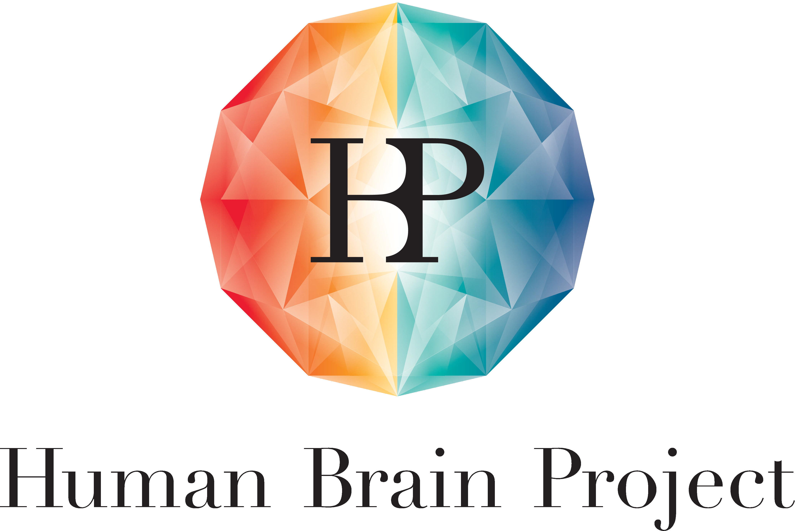

<script type="application/ld+json">
{
  "@context": "https://schema.org",
  "@type": "Person",
  "name": "Emili Balaguer-Ballester",
  "url": "https://balaguerlab.github.io/",
  "image": "https://balaguerlab.github.io/FotoAug23Alacant_2e.jpg",
  "sameAs": [
    "https://scholar.google.co.uk/citations?user=wEwLTsQAAAAJ",
    "https://orcid.org/0000-0002-0695-7191",
    "https://www.adscientificindex.com/scientist/emili-balaguer-ballester/4329519"
    "https://staffprofiles.bournemouth.ac.uk/display/eb-ballester",
    "https://www.researchgate.net/profile/Emili-Balaguer-Ballester",
    "https://dblp.org/pid/144/2855.html"
  ],
  "jobTitle": "Associate Professor",
  "affiliation": {
    "@type": "Organization",
    "name": "Bournemouth University",
    "sameAs": "https://www.bournemouth.ac.uk/"
  },
  "memberOf": [
    {
      "@type": "Organization",
      "name": "Interdisciplinary Neuroscience Research Centre",
      "url": "https://www.bournemouth.ac.uk/research/centres-institutes/interdisciplinary-neuroscience-research-centre"
    },
    {
      "@type": "Organization",
      "name": "Organization for Computational Neuroscience",
      "url": "https://www.cnsorg.org/"
    },
    {
      "@type": "Organization",
      "name": "Bernstein Centre for Computational Neuroscience Heidelberg Mannheim",
      "url": "https://bernstein-network.de/en/network/bernstein-centers/heidelberg-mannheim/"
    }
  ],
  "alumniOf": [
    {
      "@type": "CollegeOrUniversity",
      "name": "University of Mannheim",
      "sameAs": "https://en.wikipedia.org/wiki/University_of_Mannheim"
    },
    {
      "@type": "CollegeOrUniversity",
      "name": "Heidelberg University",
      "sameAs": "https://en.wikipedia.org/wiki/Heidelberg_University"
    },
    {
      "@type": "CollegeOrUniversity",
      "name": "University of Plymouth",
      "sameAs": "https://en.wikipedia.org/wiki/University_of_Plymouth"
    },
    {
      "@type": "CollegeOrUniversity",
      "name": "University of Seville",
      "sameAs": "https://en.wikipedia.org/wiki/University_of_Seville"
    },
    {
      "@type": "CollegeOrUniversity",
      "name": "University of Valencia",
      "sameAs": "https://en.wikipedia.org/wiki/University_of_Valencia"
    }
  ],
  "knowsAbout": [
    { "@type": "Thing", "name": "Computational Neuroscience", "sameAs": "http://en.wikipedia.org/wiki/Computational_neuroscience" },
    { "@type": "Thing", "name": "Machine Learning", "sameAs": "http://en.wikipedia.org/wiki/Machine_learning" },
    "Neural Dynamics",
    "Auditory Perception",
    "Data-driven Models",
    "Virtual Reality"
  ]
}
</script>

## Balaguer-Ballester lab

Our focus is on computational neuroscience. We devise machine-learning approaches and computational models for understanding neural dynamics underlying cognition, through close collaborations with human and animal neurophysiology labs. 
<br/>
Along this line, we analyse multi-electrode array recordings and biophysical models embedded in ambient Hilbert spaces underlying temporal patterns of collective neuronal activity. We also develop mesoscopic models of the auditory cortex based on neuroimaging data, operating at larger spatial scales. Current research directions also include Affect Detection models leveraging behavioural and physiological responses. In addition, we are partners in multiple Deep Learning and applied Data Science projects.

#### Featured recent publications

* Gnacek, M., Özhan, N., Broulidakis, J., Mavridou, I., Kostoulas, T., Balaguer-Ballester, E., Gjoreski, M., Gjoreski, H., Garner, M., Graf, E., Nduka, C. and Seiss, E., 2025. [Multi-modal physiological markers of arousal induced by CO2 inhalation in Virtual Reality](https://www.sciencedirect.com/science/article/pii/S1566253525007158). Information Fusion, In Press.
* Mavridou, I., Balaguer-Ballester, E., Kostoulas, T. and Seiss, E., 2025. [Affect recognition in immersive room-scale environments: A large-scale VR study with custom facial sensing at the Science Museum in London](https://ieeexplore.ieee.org/abstract/document/11145898). IEEE Access, In Press.
* Gnacek, M., Quintero, L., Mavridou, I., Balaguer-Ballester, E., Kostoulas, T., Nduka, C. and Seiss, E., 2024. AVDOS-VR: [Affective Video Database with Physiological Signals and Continuous Ratings Collected Remotely in VR](https://eprints.bournemouth.ac.uk/39384/). Nature Scientific Data, 11 (1).
* Camps-Valls, G., Gerhardus, A., Ninad, U., Varando, G., Martius, G., Balaguer-Ballester, E., Vinuesa, R., Diaz, E., Zanna, L. and Runge, J., 2023. [Discovering Causal Relations and Equations from Data](https://www.sciencedirect.com/science/article/pii/S0370157323003411). Physics Reports, 1044: 1-68.
* Dimanov, D., Singleton, C., Rostami, S. and Balaguer-Ballester, E., 2023. [MEOW-Multi-Objective Evolutionary Weapon Detection](https://proceedings.mlr.press/v224/dimanov23a). Proceedings of Machine Learning Research, PMLR 224:5/1-20.
* Rupp, A., Englitz, B., Balaguer-Ballester, E. and Andermann, M., 2022. Editorial: [Early neural processing of musical melodies](https://www.frontiersin.org/research-topics/17250/early-neural-processing-of-musical-melodies). Frontiers in Human Neuroscience, 16.

<!---* Mavridou, I., Balaguer-Ballester, E., Nduka, C. and Seiss, E., 2023. [A reliable and robust online validation method for creating a novel 3D Affective Virtual Environment and Event Library](https://eprints.bournemouth.ac.uk/38441/1/Mavridou_2023.pdf). PLoS ONE, 18.--!>
<!--* Balaguer-Ballester, E., Nogueira, R., Abofalia, J.M., Moreno-Bote, R. and Sanchez-Vives, M.V., 2020. [Representation of foreseeable choice outcomes in orbitofrontal cortex triplet-wise interactions](https://journals.plos.org/ploscompbiol/article?id=10.1371/journal.pcbi.1007862). PLoS Computational Biology, 16 (6).---!>
<!---* Tabas, A., Andermann, M., Schuberth, V., Riedel, H., Balaguer-Ballester, E. and Rupp, A., 2019. [Modeling and MEG evidence of early consonance processing in auditory cortex.](https://journals.plos.org/ploscompbiol/article?id=10.1371/journal.pcbi.1006820) PLoS Computational Biology, 15 (2).-->

#### More information and papers

[](https://staffprofiles.bournemouth.ac.uk/display/eb-ballester)&nbsp;&nbsp;&nbsp;[Bournemouth University Staff Profile](https://staffprofiles.bournemouth.ac.uk/display/eb-ballester)

[](https://www.bournemouth.ac.uk/research/centres-institutes/interdisciplinary-neuroscience-research-centre)&nbsp;&nbsp;[Interdisciplinary Neuroscience Research Centre (INRC) at Bournemouth University](https://www.bournemouth.ac.uk/research/centres-institutes/interdisciplinary-neuroscience-research-centre)

[](http://orcid.org/0000-0002-0695-7191)&nbsp;&nbsp;[ORCID](http://orcid.org/0000-0002-0695-7191)

[](https://scholar.google.co.uk/citations?user=wEwLTsQAAAAJ&hl=en)&nbsp;&nbsp;[Google Scholar](https://scholar.google.co.uk/citations?user=wEwLTsQAAAAJ&hl=en)

[](https://www.adscientificindex.com/scientist/emili-balaguer-ballester/4329519)&nbsp;&nbsp;[AD Scientific Index](https://www.adscientificindex.com/scientist/emili-balaguer-ballester/4329519)

<!--Our methodology stems from the combination of Hilbert spaces with dynamical systems, through close collaborations with experimental labs in human and animal neurophysiology--> 

<br/>

## Codebases
#### [AVDOS-VR: Affective Video Database with Physiological Signals in VR](https://bordar.bournemouth.ac.uk/462/)
[](https://github.com/michalgnacek/AVDOS-VR)

Related publications

* Gnacek, M., Özhan, N., Broulidakis, J., Mavridou, I., Kostoulas, T., Balaguer-Ballester, E., Gjoreski, M., Gjoreski, H., Garner, M., Graf, E., Nduka, C. and Seiss, E., 2025. [Multi-modal physiological markers of arousal induced by CO2 inhalation in Virtual Reality](https://www.sciencedirect.com/science/article/pii/S1566253525007158). Information Fusion, In Press.

* Gnacek, M., Quintero, L., Mavridou, I., Balaguer-Ballester, E., Kostoulas, T., Nduka, C. and Seiss, E., 2024. AVDOS-VR: [Affective Video Database with Physiological Signals and Continuous Ratings Collected Remotely in VR](https://eprints.bournemouth.ac.uk/39384/). Nature Scientific Data, 11 (1).
* Mavridou, I., Balaguer-Ballester, E., Nduka, C. and Seiss, E., 2023. [A reliable and robust online validation method for creating a novel 3D Affective Virtual Environment and Event Library](https://eprints.bournemouth.ac.uk/38441/1/Mavridou_2023.pdf). PLoS ONE, 18.

<br/>

#### [Higher-order Correlations in Neuronal Ensembles](https://doi.org/10.5281/zenodo.4306359)
<!--[]-->
<!--(https://github.com/balaguerlab/hoc)-->
[](https://doi.org/10.5281/zenodo.4306359)

Related publications

* Balaguer-Ballester, E., Nogueira, R., Abofalia, J.M., Moreno-Bote, R. and Sanchez-Vives, M.V., 2020. [Representation of foreseeable choice outcomes in orbitofrontal cortex triplet-wise interactions](https://journals.plos.org/ploscompbiol/article?id=10.1371/journal.pcbi.1007862). PLoS Computational Biology, 16 (6).

<br/>

#### [Neuronal Trajectories Reconstruction](https://doi.org/10.5281/zenodo.4306743)
<!--[]-->
<!--(https://github.com/balaguerlab/ntr)-->
[](https://doi.org/10.5281/zenodo.4306743)

Related publications:

* Balaguer-Ballester, E., Nogueira, R., Abofalia, J.M., Moreno-Bote, R. and Sanchez-Vives, M.V., 2020. [Representation of foreseeable choice outcomes in orbitofrontal cortex triplet-wise interactions](https://journals.plos.org/ploscompbiol/article?id=10.1371/journal.pcbi.1007862). PLoS Computational Biology, 16 (6).
* Lapish, C.C., Balaguer-Ballester, E., Seamans, J.K., Phillips, A.G. and Durstewitz, D., 2015. [Amphetamine exerts dose-dependent changes in prefrontal cortex attractor dynamics during working memory](http://eprints.bournemouth.ac.uk/22515/1/LapishBalaguer2015.pdf). Journal of Neuroscience, 35 (28), 10172-10187.
* Balaguer-Ballester, E., Tabas-Diaz, A. and Budka, M., 2014. [Can we identify non-stationary dynamics of trial-to-trial variability?](https://journals.plos.org/plosone/article?id=10.1371/journal.pone.0095648). PLoS One, 9 (4).
* Balaguer-Ballester, E., Lapish, C.C., Seamans, J.K. and Durstewitz, D., 2011. [Attracting dynamics of frontal cortex ensembles during memory-guided decision-making](https://journals.plos.org/ploscompbiol/article?id=10.1371/journal.pcbi.1002057). PLoS Comput Biol, 7 (5), e1002057.

<br/>

#### [Biophysical model of pitch and consonance processing in auditory cortex](https://github.com/qtabs/moch)
[](https://github.com/qtabs/moch)
<!--[](https://github.com/qtabs/moch)-->

Created and maintained by [Dr Alejandro Tabas](https://www.ikerbasque.net/en/alejandro-tabas). Related publications:
* Rupp, A., Englitz, B., Balaguer-Ballester, E. and Andermann, M., 2022. Editorial: [Early neural processing of musical melodies](https://www.frontiersin.org/research-topics/17250/early-neural-processing-of-musical-melodies). Frontiers in Human Neuroscience, 16.
* Tabas, A., Andermann, M., Schuberth, V., Riedel, H., Balaguer-Ballester, E. and Rupp, A., 2019. [Modelling and MEG evidence of early consonance processing in auditory cortex.](https://journals.plos.org/ploscompbiol/article?id=10.1371/journal.pcbi.1006820) PLoS Computational Biology, 15 (2).

<br/>

#### [Hierarchical model of pitch perception with top-down modulation](https://sourceforge.net/projects/topdownpitchmodel/files/)
[](https://sourceforge.net/projects/topdownpitchmodel/files/)

Updated by [Dr Alejandro Tabas](https://www.bcbl.eu/en/conocenos/equipo/alejandro-tabas). Related publications:
* Tabas, A., Siebert, A., Supek, S., Pressnitzer, D., Balaguer-Ballester, E. and Rupp, A., 2016. [Insights on the neuromagnetic representation of temporal asymmetry in human auditory cortex](https://journals.plos.org/plosone/article?id=10.1371/journal.pone.0153947). PLoS ONE, 11 (4).
* Balaguer-Ballester, E., Clark, N.R., Coath, M., Krumbholz, K. and Denham, S.L., 2009. [Understanding pitch perception as a hierarchical process with top-down modulation](https://journals.plos.org/ploscompbiol/article?id=10.1371/journal.pcbi.1000301). PLoS Comput Biol, 5 (3), e1000301.

<br/>

## Active projects

#### Collaboration with [Maurizio Mattia](https://www.researchgate.net/profile/Maurizio-Mattia), [Andrea Galuzzi](https://www.researchgate.net/profile/Andrea-Galluzzi) and [Mavi Sanchez-Vives](https://www.sanchez-vives.org/)
*Validating Cortical Network Models at the Edge of Asynchrony*

* Funding: [Royal Society International Exchanges (March 2021-March 2025).](https://royalsociety.org/grants-schemes-awards/grants/international-exchanges/)

<br/>
<br/>

#### Collaboration with [Andrew Rowley](https://apt.cs.manchester.ac.uk/people/arowley/), [Maurizio Mattia](https://www.researchgate.net/profile/Maurizio-Mattia), [Andrea Galuzzi](https://www.researchgate.net/profile/Andrea-Galluzzi) and [Mavi Sanchez-Vives](https://www.sanchez-vives.org/)
*Neuromorphic Hardware Operating at the Edge of Asynchrony*

* Funding: [Human Brain Project, Vouchers Scheme (July 2022-Sept 2023). European Research Council.](https://www.humanbrainproject.eu/en/)

<br/>

#### Collaboration with [Mavi Sanchez-Vives](https://www.sanchez-vives.org/)

*Propagation of spontaneous activity in confined neuronal networks*

<!--* In partnership with [Mavi Sanchez-Vives](https://www.sanchez-vives.org/) and [Xun He](https://staffprofiles.bournemouth.ac.uk/display/xhe)-->
* PhD project by [Roman Arango-Cabrera](https://www.humanbrainproject.eu/en/about/project-structure/partnering-projects/async-prop/)
* Funding: [Async-Prop](https://www.humanbrainproject.eu/en/about/project-structure/partnering-projects/async-prop/). Partnering Project of the HBP SP3 (EU H2020 Research and Innovation Programme). [Bournemouth University](https://www.bournemouth.ac.uk/) & [Institute for Biomedical Research 'August Pi in Sunyer'](https://www.clinicbarcelona.org/en/idibaps/research-areas/clinical-and-experimental-neuroscience/systems-neuroscience). 

<br/>

#### Collaboration with [Ellen Seiss (PI)](https://staffprofiles.bournemouth.ac.uk/display/eseiss), [Theodoros Kostolulas](https://www.theodoros-kostoulas.com/), [Charles Nduka-Emteq labs](https://www.emteqlabs.com/)

*Affect Recognition in Virtual Reality Environments*

* EngD project by [Michal Gnacek](https://uk.linkedin.com/in/gnacek)
* Funding: [EPSRC Centre for Doctoral Training -Centre for Digital Entertainment](https://www.digital-entertainment.org/). Bournemouth University/Bath University & [Emteq labs](https://www.emteqlabs.com/).

<br/>

#### Collaboration with [Shahin Rostami](https://www.linkedin.com/in/shahinrostami/?originalSubdomain=uk), [Colin Singelton-Counting labs](https://www.countinglabs.co.uk/)
*Efficient Multi-Objective NeuroEvolution in Computer Vision*

* PhD project by [Daniel Dimanov](https://www.researchgate.net/profile/Daniel_Dimanov) 
* Funding: [Counting labs](https://www.countinglabs.co.uk/) & Bournemouth University.

<br/>

#### Collaboration with [Phillip Davies (PI)](https://staffprofiles.bournemouth.ac.uk/display/daviesp), [Jane Healy](https://staffprofiles.bournemouth.ac.uk/display/jhealy)
*Structural Equation Modelling of Quality of Life*
 
* PhD project by [Ogochukwu Ijezie](https://staffprofiles.bournemouth.ac.uk/display/oijezie)
* Funding: Self-funded & Bournemouth University.

<br/>
  
## Lab PI
#### [Emili Balaguer-Ballester, Associate Professor, Bournemouth University](https://staffprofiles.bournemouth.ac.uk/display/eb-ballester)

**Contact:**

* Faculty of Media, Science and Technology, [School of Computing and Engineering](https://www.bournemouth.ac.uk/about/our-faculties/faculty-science-technology/our-departments/department-computing-informatics)
* [Interdisciplinary Neuroscience Research Centre](https://www.bournemouth.ac.uk/research/centres-institutes/interdisciplinary-neuroscience-research-centre), Bournemouth University. BH12 5BB Bournemouth, UK.
* Phone: +44 (0)1202 965 795.
  <!--* Twitter: @emilibalball. Email: eb-ballester@bournemouth.ac.uk--!>


<br/>
                     
## Completed PhD students
**[Dr Michal Gnacek](https://scholar.google.ca/citations?user=OOYLt2YAAAAJ). [PI: Dr Ellen Seiss](https://staffprofiles.bournemouth.ac.uk/display/eseiss)**
* [Mobile Capital Network.](https://www.mobilecapital.net/)

**[Dr Roman Arango-Cabrera](https://www.linkedin.com/in/rom%C3%A1n-arango-1856245a/)**
* [University of Cambridge.](https://www.linkedin.com/in/rom%C3%A1n-arango-1856245a/)

**[Dr Ogochukwu Ijezie](https://staffprofiles.bournemouth.ac.uk/display/oijezie). [PI: Dr Phillip Davies](https://www.researchgate.net/profile/Philip-Davies-5)**
* [Office for National Statistics.](https://staffprofiles.bournemouth.ac.uk/display/oijezie)

**[Dr Daniel Dimanov](https://www.researchgate.net/profile/Daniel_Dimanov)**
* [Counting Labs.](https://www.countinglabs.co.uk/)

**[Dr Ifigeneia Mavridou](https://www.tilburguniversity.edu/staff/i-mavridou)**
* [Tilburg University.](https://www.tilburguniversity.edu/staff/i-mavridou)

**[Dr Aris Michailidis](https://loop.frontiersin.org/people/520360/bio)**
* [London Studio Playstation, Sony Corp.](https://playstationlondonstudio.com/)

**[Dr Alejandro Tabas](https://www.bcbl.eu/en/conocenos/equipo/alejandro-tabas)**
* [Basque Centre for Cognition, Brain and Language.](https://www.bcbl.eu/en/conocenos/equipo/alejandro-tabas)

**[Dr Juan Camilo Avendaño Diaz](https://research.aalto.fi/en/persons/juan-avendano-diaz). [PI: Dr Xun He](https://staffprofiles.bournemouth.ac.uk/display/xhe)**
* [Aalto University.](https://research.aalto.fi/en/persons/juan-avendano-diaz)

**[Dr Bassma Al-Jubouri](https://www.ntnu.edu/employees/bassma.al-jubouri)**
* [Norwegian University of Science and Technology.](https://www.ntnu.edu/)

**[Dr Rebecca Elisa](https://www.linkedin.com/in/rebecca-elisa-phd-0747a484/?originalSubdomain=uk). [PI: Dr Ben Parris](https://staffprofiles.bournemouth.ac.uk/display/bparris)**
* [Wave Healthcare.](https://www.wavehealthcare.co.uk/)

**[Dr Mohammad Heydari](https://www.surrey.ac.uk/people/mohammad-heydari). [PI: Dr Alexios Mylonas](https://researchprofiles.herts.ac.uk/portal/en/persons/alexios-mylonas)**
* [University of Surrey.](https://www.surrey.ac.uk/people/mohammad-heydari)

**[Dr Amir Rafati-Afshar](https://www.linkedin.com/in/aarafatiafshar)**
* [Barnes & Noble, Inc.](https://www.barnesandnobleinc.com/)

**[Dr Gizem Abaraci](https://staffprofiles.bournemouth.ac.uk/display/garabaci). [PI: Dr Ben Parris](https://staffprofiles.bournemouth.ac.uk/display/bparris)**
* [Bournemouth University.](https://staffprofiles.bournemouth.ac.uk/display/garabaci)

**[Dr Mohsen Amiribesheli](https://scholar.google.com/citations?user=hm3nTqgAAAAJ&hl=en). [PI: Dr Hamid Bouchachia](https://staffprofiles.bournemouth.ac.uk/display/abouchachia)**
* [Konica Minolta Global R&D.](https://research.konicaminolta.com/)

**[Dr Waqas Jamil](https://www.linkedin.com/in/waqas-jamil-360a6721/?originalSubdomain=uk). [PI: Dr Hamid Bouchachia](https://staffprofiles.bournemouth.ac.uk/display/abouchachia)**
* [Roxbury Asset.](http://roxbury-am.com/)


<!---         
           
Markdown is a lightweight and easy-to-use syntax for styling your writing. It includes conventions for

```markdown
Syntax highlighted code block

# Header 1
## Header 2
### Header 3

- Bulleted
- List

1. Numbered
2. List

**Bold** and _Italic_ and `Code` text

[Link](url) and 
```

For more details see [GitHub Flavored Markdown](https://guides.github.com/features/mastering-markdown/).

### Jekyll Themes

Your Pages site will use the layout and styles from the Jekyll theme you have selected in your [repository settings](https://github.com/balaguerlab/balaguerlab.github.io/settings). The name of this theme is saved in the Jekyll `_config.yml` configuration file.

### Support or Contact

Having trouble with Pages? Check out our [documentation](https://docs.github.com/categories/github-pages-basics/) or [contact support](https://github.com/contact) and we’ll help you sort it out.
-->
